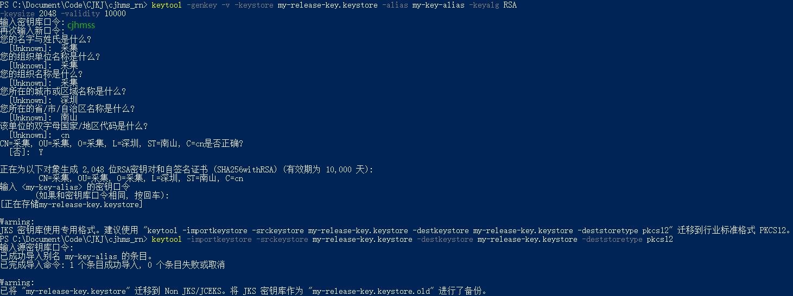

## React Native Android打包apk

### 五步流程
1. 终端运行 `keytool -genkey -v -keystore my-release-key.keystore -alias my-key-alias -keyalg RSA -keysize 2048 -validity 10000` 不能使用window自带的命令行终端，否则会报错

[剩下步骤请看官方教程](https://reactnative.cn/docs/signed-apk-android/)