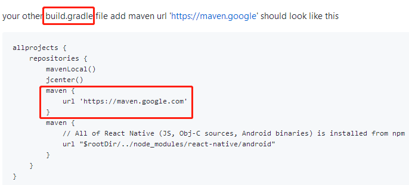
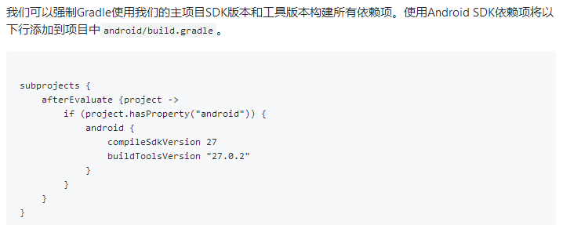

### 升级react-native[文档](https://reactnative.cn/docs/0.41/upgrading.html)

#### 问题1：报错 Could not find com.android.support:appcompat-v7:26.1.0
`
A problem occurred configuring project ':app'.
Could not resolve all dependencies for configuration ':app:_debugApk'.
A problem occurred configuring project ':lottie-react-native'.
> Could not resolve all dependencies for configuration ':lottie-react-native:_debugPublishCopy'.
> Could not find com.android.support:appcompat-v7:26.1.0.
Required by:
QuickChinese:lottie-react-native:unspecified > com.airbnb.android:lottie:2.2.5
`
#### 问题1：[解决方案](https://github.com/react-community/lottie-react-native/issues/203)

#### 问题2：报错 
`
..........
:react-native-image-picker:mergeReleaseResources
:react-native-image-picker:processReleaseManifest
:react-native-image-picker:processReleaseResources
/Users/.../Documents/work/.../node_modules/react-native-image-picker/android/build/intermediates/res/merged/release/values-v26/values-v
26.xml:15:21-54: AAPT: No resource found that matches the given name: attr 'android:keyboardNavigationCluster'.

/Users/.../Documents/work/.../node_modules/react-native-image-picker/android/build/intermediates/res/merged/release/values-v26/values-v
26.xml:15: error: Error: No resource found that matches the given name: attr 'android:keyboardNavigationCluster'.

:react-native-image-picker:processReleaseResources FAILED

FAILURE: Build failed with an exception.

* What went wrong:
Execution failed for task ':react-native-image-picker:processReleaseResources'.
> com.android.ide.common.process.ProcessException: Failed to execute aapt
`
#### 问题2：[解决方案](https://github.com/react-community/react-native-image-picker/issues/882)
